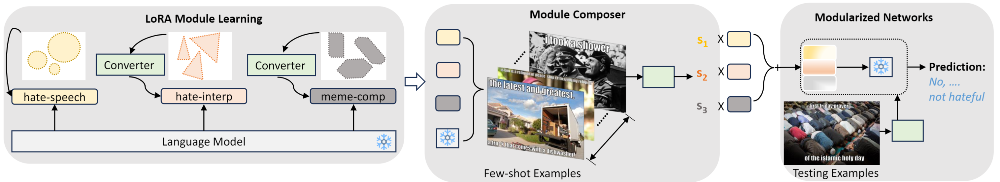

# Mod_HATE
Official implementation for: Modularized Networks for Few-shot Hateful Meme Detection

This includes an original implementation of "[Modularized Networks for Few-shot Hateful Meme Detection][paper]" by Rui Cao, Roy Ka-Wei Lee, Jing Jiang.

<p align="center">
  
</p>

This code provides:
- Codes for training LoRA modules for hate speech detection, meme comprehension and hateful meme interpretation.
- Composing trained LoRA modules and adapt composed modules to few-shot hateful meme detection.

Please leave issues for any questions about the paper or the code.

If you find our code or paper useful, please cite the paper:
```
@inproceedings{ caojiang2024kgenvqa,
    title={Knowledge Generation for Zero-shot Knowledge-based VQA},
    author={ Rui Cao, Jing Jiang},
    journal={EACL},
    year={ 2024 }
}
```

### Announcements
01/25/2023: We released our implementation for our WWW submission: Modularized Networks for Few-shot Hateful Meme Detection.

## Content
1. [Installation](#installation)
2. [Prepare Datasets](#prepare-datasets)
    * [Datasets for Hateful Meme Detection](#datasets-for-hateful-meme-detection)
    * [Datasets for Module Training](#datasets-for-module-training) 
4. [Training LoRA modules](#training-lora-modules) (Section 4.2 of the paper)
    * [Step 1: Data Conversion](#step-1-data-conversion) 
    * [Step 2: Module Training](#step-2-module-training) 
5. [Modularized Networks for Hateful Meme Detection](#modularized-networks-for-hateful-meme-detection) (Section 4.3 and Section 5 of the paper)
    * [Step 1: Module Composition](#step-1-module-composition) 
    * [Step 2: Experiments](#step-2-experiments)   

## Installation
The code is tested with python 3.9. To run the code, you should install the package of transformers provided by Huggingface (version 4.33.0), PyTorch library, PEFT Library (version 0.5.0), Nevergrad. The code is implemented with the CUDA of 11.2 (you can also implement with other compatible versions) on NIVIDA A40 GPU, each with a dedicated memory of 48GB. For the implementation of LLaMA model, we leverage the HuggingFace Library with the *yahma/llama-7b-hf* checkpoint.

###
## Prepare Datasets

### Datasets for Hateful Meme Detection
We have tested on two hateful meme benchmarks: *Facebook Hateful Meme* dataset [(FHM)][fhm_dataset] and *Multimedia Automatic Misogyny Identification* dataset [(MAMI)][mami_dataset]. The datasets can be download online. If you download dataset, you need to pre-process the datasets follow the code of the [paper][pro_cap]: *Pro-Cap: Leveraging a Frozen Vision-Language Model for Hateful Meme Detection*. Alternatively, you can directly leverage the converted data shared by [Pro-Cap][pro_cap_data]. Noted, they denote MAMI dataset as mimc.

### Datasets for Module Training
We trained module capable of relevant tasks for hateful meme detection. Specifically, we focus on three relevant tasks: *hate speech detection*, *meme comprehension* and *hateful meme interpretation*. To train these modules, you need to first prepare data about these tasks. Below are datasets we considered for each task:

- Hate speech detection: we merge three hate speech detection dataset for training the module. Specifically, we leverage [DT][dt_data], WZ[wz_data] and Gab[gab_data] and consider hate speech detection as a generation task.
- Meme comprehension: we consider the [MemeCap][meme_cap] dataset. Given a meme, the task requires generation of its meaning. Beyond image captioning, the task also calls for recognizing and interpreting visual metaphors with respect to the text inside or around the meme.
- Hateful meme interpretation: we consider the [HatReD](hatred_data) dataset. Given a hateful meme, it requires generating the underlying hateful contextual reasons.

Alternatively, you can directly use our shared dataset in the *data* folder. *hate-speech* is the data for hate speech detection, *meme-interp* is for meme comprehension, and *hateful-meme-explain* is for explaining hateful memes.

## Training LoRA modules

Here we describe how we generate relevant knowledge for questions by prompting GPT-3 (details in Section 3.1). Specifically, we prompt GPT-3 with demonstrations in *OK_VQA/demonstrations.txt* to initialize one piece of knowledge for each question. Then we diversify knowledge with the self-supervised knowledge diversification technique.

### Step 1: Data Conversion
We leverage the in-context learning capability of GPT-3 and prompt it with a few-demonstrations. You can try to generate initialized knowledge with the help of GPT-3. The code for initialization can be found in [src/kb-gen/knowledge-initialization.ipynb](src/kb-gen/knowledge-initialization.ipynb).

### Step 2: Module Training
We next diversify generated knowledge with self-supervised diversification technique. The code can be found in [src/kb-gen/knowledge-diversification.ipynb](src/kb-gen/knowledge-diversification.ipynb). Alternatively, you can directly leverage our generated knowledge for OK-VQA and A-OKVQA in the folder [src/OK_VQA/cluster_generated_kb](src/OK_VQA/cluster_generated_kb) and [src/A_OKVQA/cluster_generated_kb](src/A_OKVQA/cluster_generated_kb) respectively.


### Modularized Networks for Hateful Meme Detection
We finally incoporate our generated knowledge into text-based question-answering models, to show the effectiveness of generated knowledge. We tested three text-based question answering models: UnifiedQa, OPT and GPT-3.

### Step 1: Module Composition
Code can be found in [src/unifiedQA](src/unifiedQA), which is for the 3B version of UnifiedQA. For the answers for OK-VQA, please apply code in [src/unifiedQA/Ans_Norm.ipynb](src/unifiedQA/Ans_Norm.ipynb) to conduct answer normalization. Predicted answers are also included in the [src/unifiedQA](src/unifiedQA) folder.

### Step 2: Experiments
Code for using OPT as the text-based question answering model can be found in the [src/opt](src/opt) folder.


[fhm_dataset]: https://arxiv.org/abs/2005.04790
[mami_dataset]: https://aclanthology.org/2022.semeval-1.74/
[pro_cap]: https://arxiv.org/abs/2308.08088
[pro_cap_data]: https://github.com/Social-AI-Studio/Pro-Cap/tree/main/Data
[dt_data]: https://arxiv.org/abs/1703.04009
[wz_data]: https://aclanthology.org/N16-2013/
[gab_data]: https://aclanthology.org/D19-1482/
[meme_cap]: https://arxiv.org/abs/2305.13703
[hatred_data]: https://www.ijcai.org/proceedings/2023/0665.pdf
